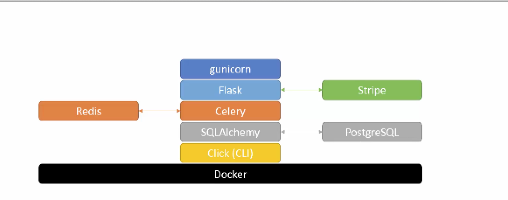
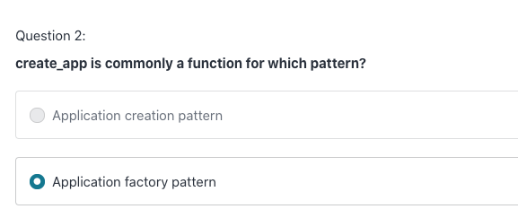
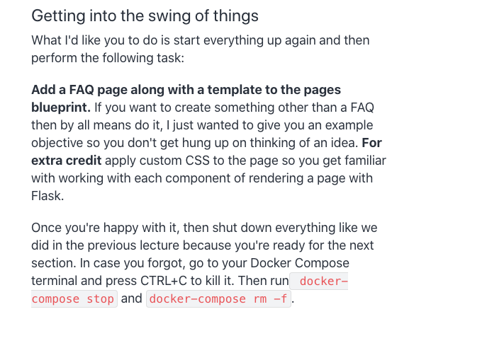
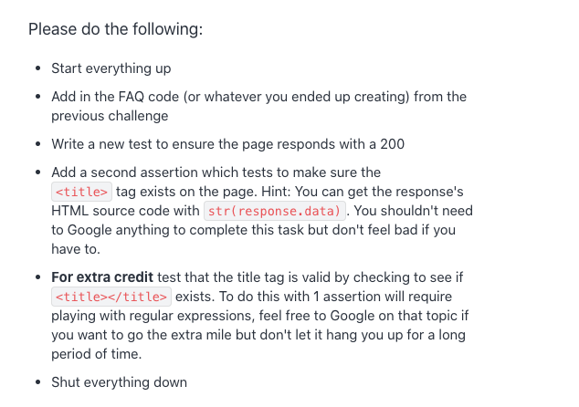
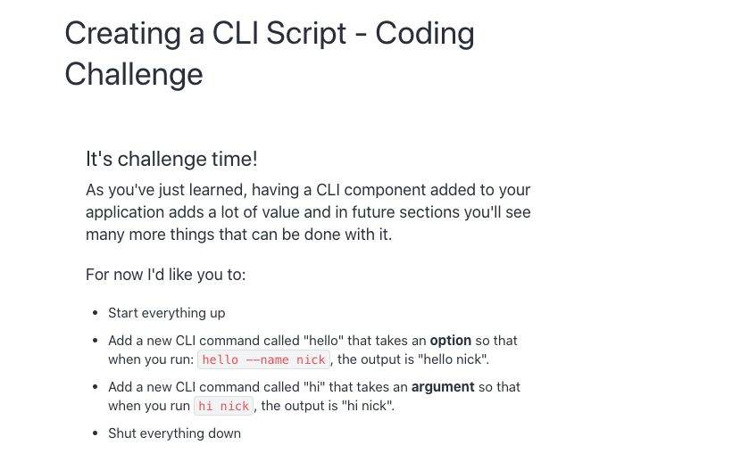

# updated course links

* [Docker](https://buildasaasappwithflask.com/)
* [udpates]()

# Architecture 

## gunicorn vs uwsgi



## Take a look at the Application 

### Question:

* what is the app? 
* what is the `rout()` function? (confused about front end and backend)
* 


```python
def create_app():
    """
    Create a Flask application using the app factory pattern.

    :return: Flask app
    """
    app = Flask(__name__, instance_relative_config=True)

    app.config.from_object('config.settings')
    app.config.from_pyfile('settings.py', silent=True)

    @app.route('/')
    def index():
        """
        Render a Hello World response.

        :return: Flask response
        """
        return 'Hello World!'

    return app

```


## React

```js
class App extends Component {
  render() {
    return (
      <div className="App">
        <Router>
          <div>
            <Navbar />
            <Switch>
              <Route exact path="/" component={Home} />
              <Route exact path="/products" component={FileQuery} />
              <Route exact path="/admin" component={FileAdmin} />
            </Switch>
            <Footer />
          </div>
        </Router>
      </div>
    );
  }
}
```


# Docker

https://buildasaasappwithflask.com/

### Questions: 

* What's the difference between docker and virtual enviroment 
* What's happening when I type `docker-compose up --build`

> when download the dependencies, where are they located. 

* I don't understand "Listening at: http://0.0.0.0:8000"

* how docker knows the *.env file 

* What is image and what is container? 

* What is the port? 

* What the differences between the config file and instance file 

* 

* 

  


### build image 

Compose is a tool for defining and running multi-container Docker applications. With Compose, you use a YAML file to configure your application’s services. Then, with a single command, you create and start all the services from your configuration. To learn more about all the features of Compose, see [the list of features](https://docs.docker.com/compose/#features).

Using Compose is basically a three-step process:

1. Define your app’s environment with a `Dockerfile` so it can be reproduced anywhere.
2. Define the services that make up your app in `docker-compose.yml` so they can be run together in an isolated environment.
3. Run `docker-compose up` and Compose starts and runs your entire app.


`docker-compose up --build `

> everytime add new packages, we need run `docker-compose up --build`

`docker-machine ip`

`docker-compose stop`

`docker images`

> list the images 

`docker-compose ps`

> list container 

`docker-compose rm -f`

> rm docker container 

`docker rmi -f $(docker images -qf dangling=true)`

> rm dangling container 

## test

`docker-compose exec website`

`docker-compose exec website py.test --cov-report term-missing --cov snakeeyes`

### flake8 

test the format 

* `docker-compose exec website flake8 . `
* `docker-compose exec website flake8 . --exclude __init__.py`


## docker yaml file

```yaml
version: '2'

services:
## define image name 
  website:
    build: .
    command: >
      gunicorn -b 0.0.0.0:8000
        --access-logfile -
        --reload
        "snakeeyes.app:create_app()"
    environment:
      PYTHONUNBUFFERED: 'true'
    volumes:
      - '.:/snakeeyes'
 ### the left is port of host
 , right side is the port of docker container 
    ports:
      - '8000:8000'
```


# dealing with configuration 

```python
### use config file 
app = Flask(__name__, instance_relative_config=True)

## path of config file 
app.config.from_object('config.settings')
### silent = True means don't crash if couldn't find "setting.py" file 
app.config.from_pyfile('settings.py', silent=True)
```

## config/setting.py

```python
### never use Debug mode in the application 
### the variable should be uppercase, otherwise it won't be avalaible outside this file 
DEBUG = True
HELLO = 'hello world!!'

```

### how to access the variable outside of the file 

```python
from flask import Flask
def create_app():
    app = Flask(__name__, instance_relative_config=True)

    app.config.from_object('config.settings')
    app.config.from_pyfile('settings.py', silent=True)

    @app.route('/')
    def index():
      ### access the config variables 
        return app.config['HELLO']

    return app

```


## instance file


# Flask Blueprint 

### Questions


Each blueprint is a component of the application 

```python
from flask import Flask

from snakeeyes.blueprints.page import page


def create_app():
    """
    Create a Flask application using the app factory pattern.

    :return: Flask app
    """
    app = Flask(__name__, instance_relative_config=True)

    app.config.from_object('config.settings')
    app.config.from_pyfile('settings.py', silent=True)
    ### call blueprint page 
    app.register_blueprint(page)

    return app
```


## First blueprint

* Django uses MTV(model-template-view)
* Rails uses MVC(model-view-controller)


```python
from flask import Blueprint, render_template

page = Blueprint('page', __name__, template_folder='templates')


@page.route('/')
def home():
    return render_template('page/home.html')


@page.route('/terms')
def terms():
    return render_template('page/terms.html')


@page.route('/privacy')
def privacy():
    return render_template('page/privacy.html')
```


## Bootstrap and font-awesome 

bootstrap is a popoluar lilbary for front-end development

## Jinia 2 template 

* What are its top feature

  > * template interitance
  > * HTML escaping 
  > * flexible and extensibility

* Understanding Jinja 2 templates
  * Add programming constructs to HTML templates
  * Transfer information from Flask to HTML templates
  * Imagine listing users in an admin dashboard
  * Ultimately it lets us separte data from the presentation 


### coding challenge



# Testing and Code Quality

### Questions:

* 

`docker-compose exec website py.test snakeeyes/tests`

## pytest

```python
import pytest

from snakeeyes.app import create_app


@pytest.yield_fixture(scope='session')
def app():
    """
    Setup our flask test app, this only gets executed once.

    :return: Flask app
    """
    params = {
        'DEBUG': False,
        'TESTING': True,
    }

    _app = create_app(settings_override=params)

    # Establish an application context before running the tests.
    ctx = _app.app_context()
    ctx.push()

    yield _app

    ctx.pop()


@pytest.yield_fixture(scope='function')
def client(app):
    """
    Setup an app client, this gets executed for each test function.

    :param app: Pytest fixture
    :return: Flask app client
    """
    yield app.test_client()

```

### test coverage 

`docker-compose exec website py.test --cov-report term-missing --cov snakeeyes`

### Performing static analysis on the code base 

* flake8

  `docker-compose exec website flake8 . `

  `docker-compose exec website flake8 . --exclude __init__.py`


### coding challenge



# Creating CLI script

write script to run commad 

`docker-compose exec website snakeeyes`

` docker-compose exec website snakeeyes flake8 `


### coding challenge 




```python
import subprocess

import click


@click.command()
@click.argument('path', default='snakeeyes')
def cli(path):
    """
    Run a test coverage report.

    :param path: Test coverage path
    :return: Subprocess call result
    """
    cmd = 'py.test --cov-report term-missing --cov {0}'.format(path)
    return subprocess.call(cmd, shell=True)
```

